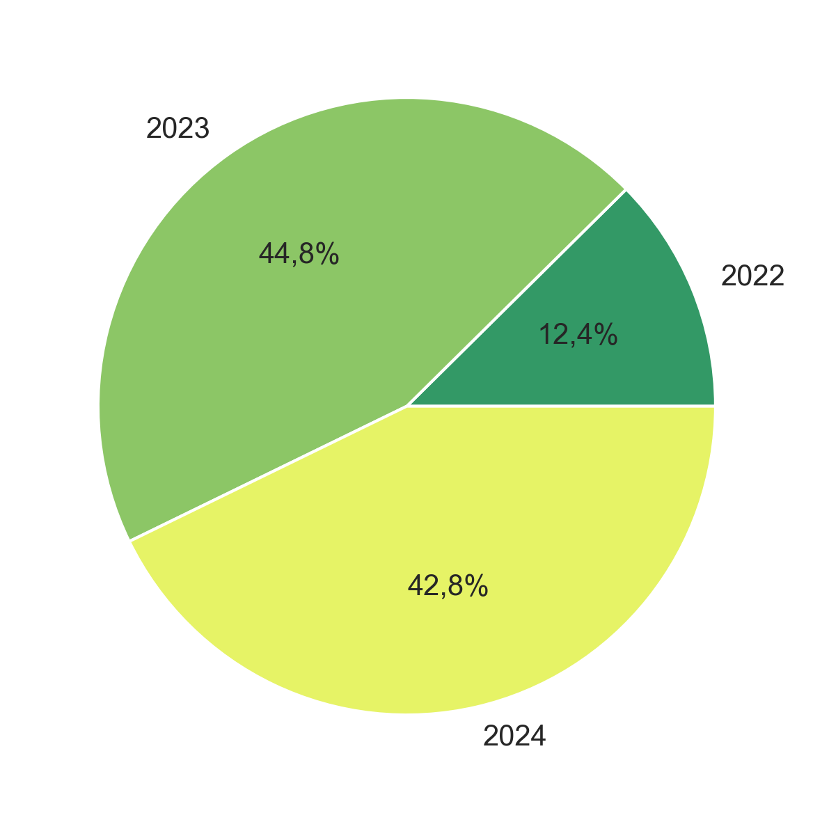
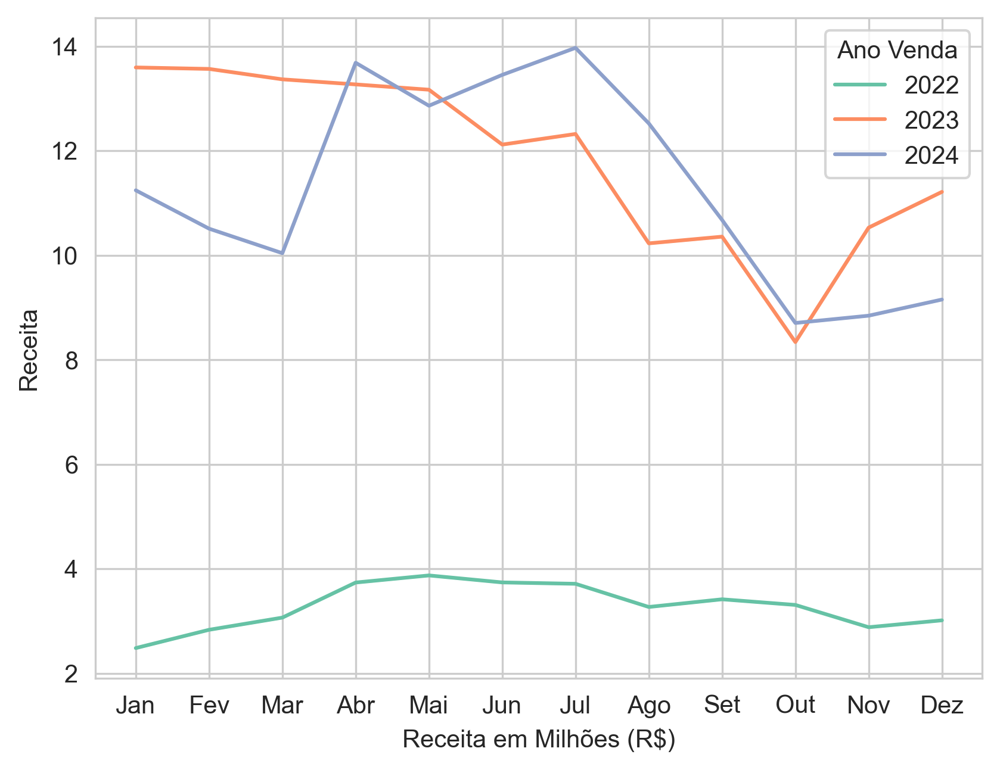
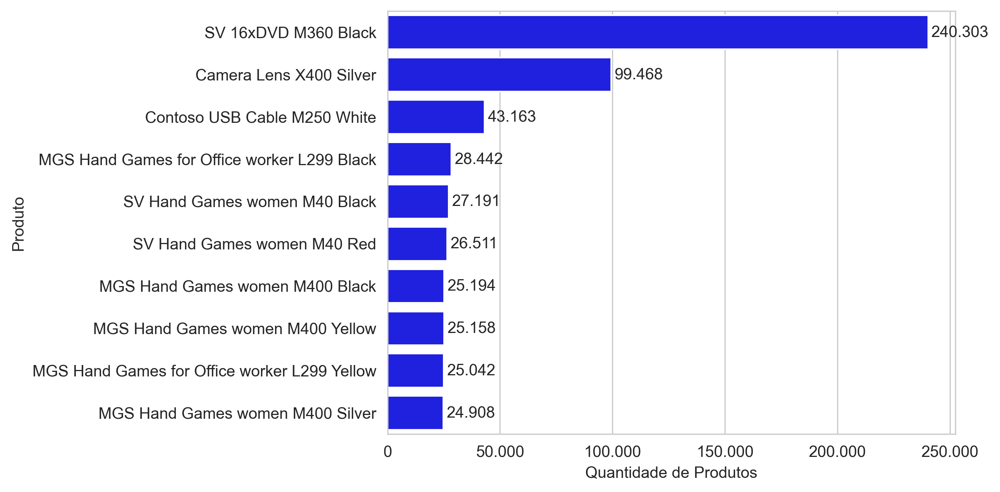
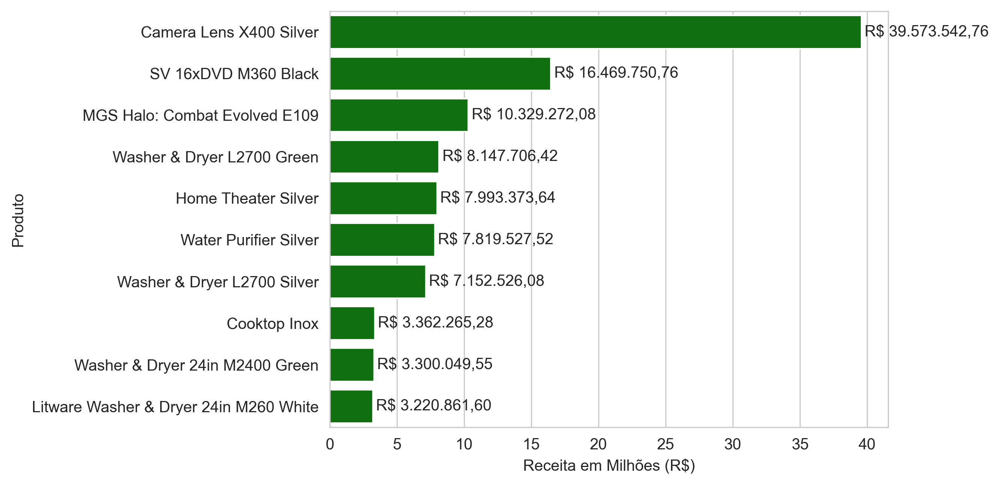
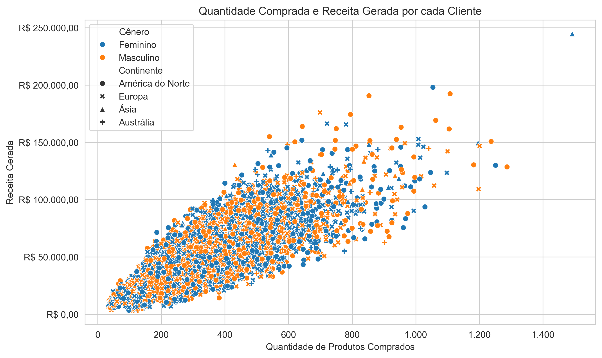
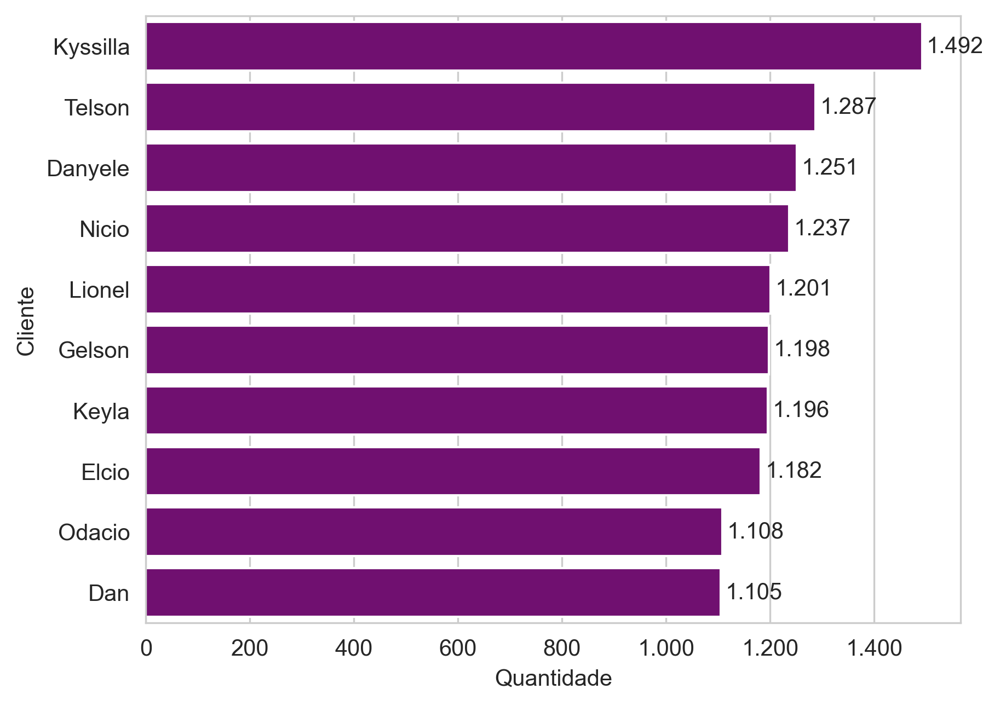
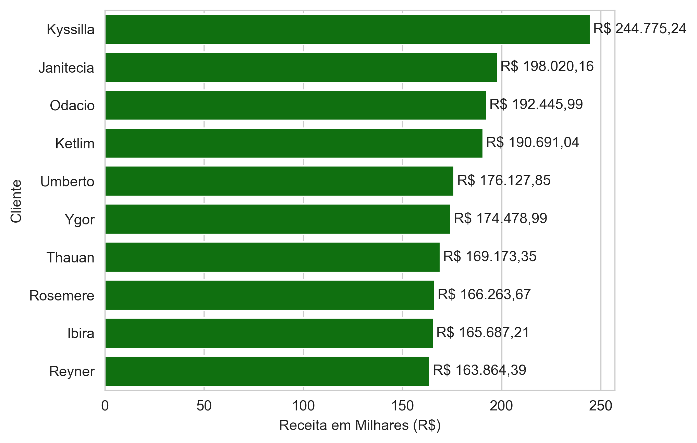
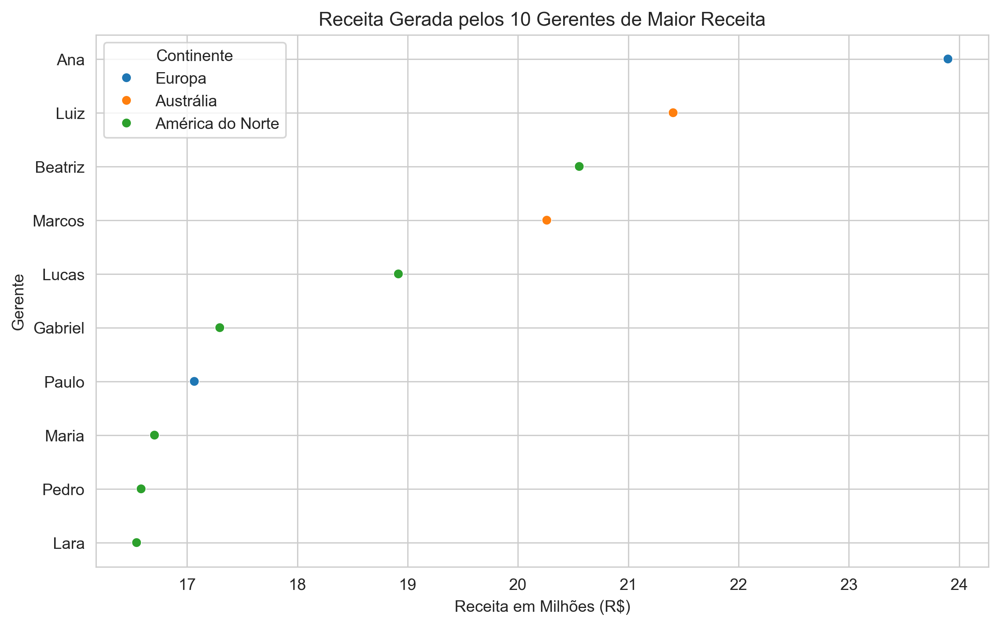
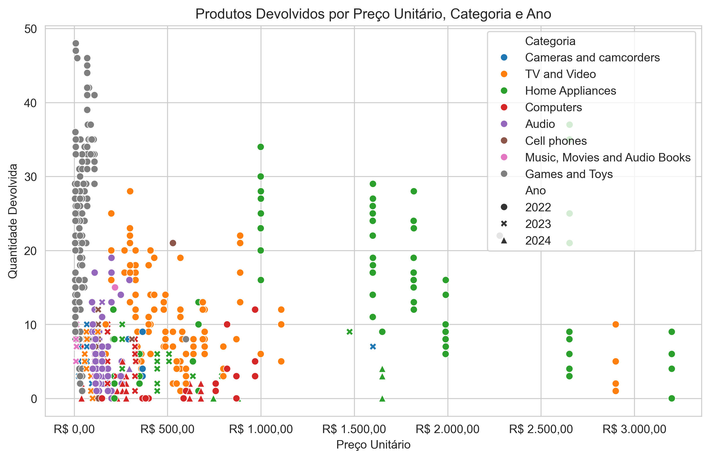
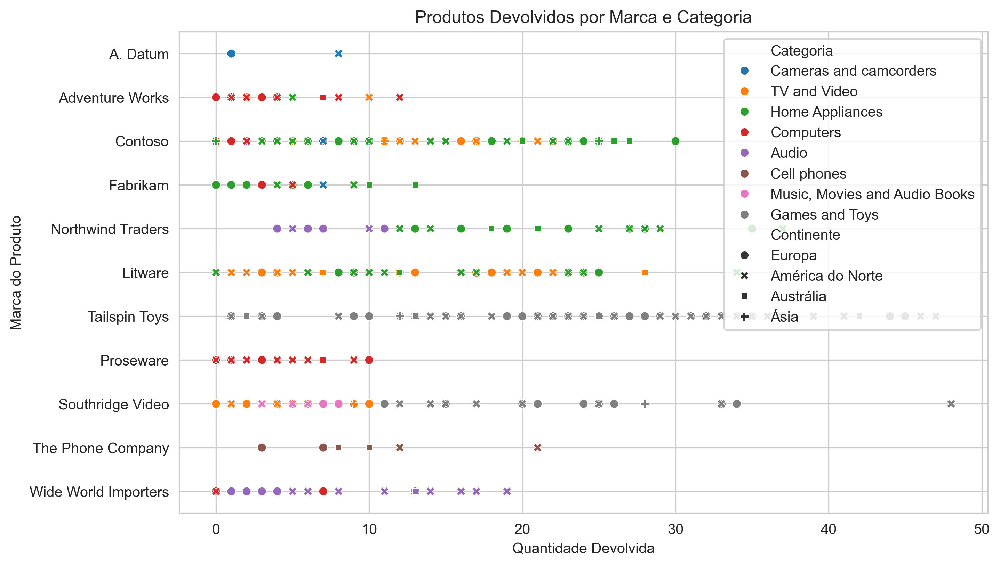

# 📊 Análise Exploratória de Dados de Vendas

Projeto desenvolvido com o objetivo de aplicar técnicas de Análise Exploratória de Dados (EDA) utilizando Python. Foram realizadas etapas de limpeza, tratamento, integração e visualização de dados para extrair informações relevantes sobre vendas, clientes, produtos e desempenho comercial.


## Objetivo

Realizar uma análise exploratória em uma base de vendas para identificar padrões, tendências e indicadores que possam auxiliar na tomada de decisão.


## Tecnologias utilizadas

- Python
- Pandas
- Matplotlib
- Seaborn
- Jupyter Notebook


## Etapas da análise

- Importação dos dados
- Limpeza e padronização
- Tratamento de valores ausentes
- Conversão de tipos de dados
- Integração das tabelas
- Criação de novas variáveis
- Estatísticas descritivas
- Visualização gráfica


## Principais análises

- Receita por ano
- Receita por continente
- Produtos mais vendidos
- Clientes com maior faturamento
- Distribuição das vendas
- Ticket médio
- Evolução temporal das vendas


## Estrutura do projeto

```
00_Analise_Vendas/
├── notebooks/
│   ├── src/
│   │    └── limpeza.py
│   ├── 01_tratamento.ipynb
│   ├── 02_tratamento.ipynb
│   ├── 03_integracao.ipynb
│   └── 04_analise.ipynb
├── images/
├── processed/
└── raw/
```


## Resultados

A análise permitiu identificar:
- receita total anual e como o faturamento foi distribuído pelos anos.
```
Ano
2022    39.3478 Milhões de Reais
2023    142.0575 Milhões de Reais
2024    135.6491 Milhões de Reais
```



- comportamento temporal das receitas para identificação de 
sazonalidade nas vendas;


- produtos mais vendidos e com maior faturamento;



- clientes que mais compram e mais geram receita;



- gerentes que mais vendem e mais geram receita;


- produtos mais devolvidos;


- distribuição das vendas entre continentes;
- marcas de produtos mais vendidas.


## Melhorias futuras

- Dashboard em Power BI (Em Construção)


- Modelos de Machine Learning
- Automatização do pipeline


## Autor

Lucas Sala Alves